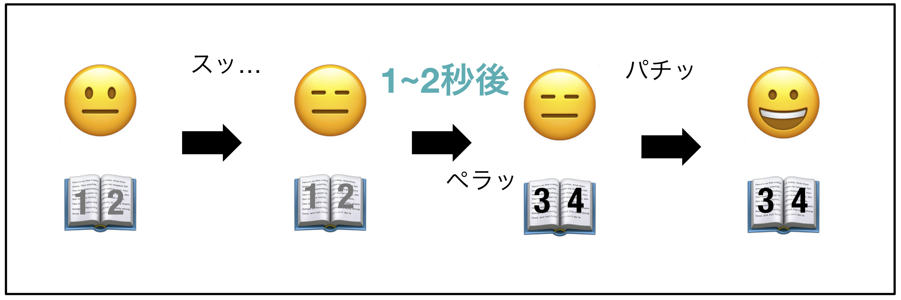

電子書籍まばたきUI_研究資料まとめ
============================
資料はここに全てまとめる。
卒論のweb版的な感じで。

今後の予定
--------
☑︎ デモアプリの作成  
☑︎ デモアプリをAppstoreで公開  
☐ デモアプリを用いて実験  
☐ 論文執筆  
☐ 卒研最終発表スライド作成  
☐ 190220 卒研最終発表  
☐ 190221 卒論PDF提出  
- [x] @mentions, #refs, [links](), **formatting**, and <del>tags</del> supported
- [x] list syntax required (any unordered or ordered list supported)
- [x] this is a complete item
- [ ] this is an incomplete item

デモアプリ
--------
ソースコードは別リポジトリ  
[https://github.com/aitusa/App_FlipByBlink](https://github.com/aitusa/App_FlipByBlink)  
Appstoreでデモアプリ公開中  
[https://itunes.apple.com/jp/app/flipbyblink-まばたき読書/id1444571751?mt=8](https://itunes.apple.com/jp/app/flipbyblink-まばたき読書/id1444571751?mt=8)  
FaceID搭載のiOS端末でのみ動作します。iPhone XやiPad pro(2018)など。

中間予稿
-------
[中間予稿のPDF](中間予稿.pdf)

何か指摘、感想、アドバイス
----------------------
本ドキュメントのgithubのissuesにどうぞ。  
[https://github.com/aitusa/document_thesis_BlinkByBlink/issues](https://github.com/aitusa/document_thesis_BlinkByBlink/issues)
